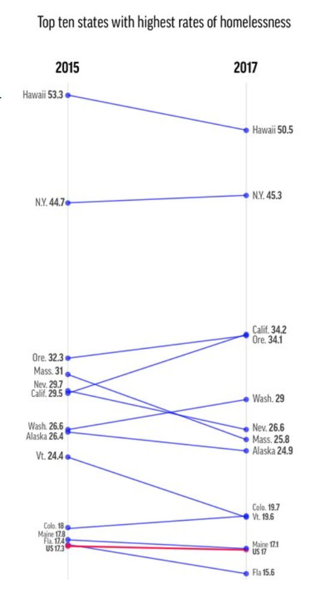

```{r setup, include=FALSE} 
knitr::opts_chunk$set(warning = FALSE, message = FALSE) 
library(tidyverse)
library(readr)
library(janitor)
library(readxl)
```


# Assignment 1: Plot Deconstruction

Initial graph (seen below): 

1. Did not have units (after some research, found that the rate of homelessness is x out of 10,000 people)

2. Did not read easily 

3. Said it represents the 10 states with the highest rates of homelessness but really showed 12

4. Showed that the average rate of homelessness in the US decreased, while the article claimed that the rate had increased (article title: "America’s homeless population rises for first time in years")

5. Is no longer found in the original article - maybe they realized it does not support the argument that the article is making




### Import and wrangle data:

Import data: 

```{r}
homelessness <- read_excel("~/Desktop/MB5370 Techniques 1/MB5370 Module 4 Homelessness.xlsx")
```


Group by state and find the difference in homelessness rate from 2015 to 2017:

```{r}
homelessness_summary <- homelessness %>% 
  group_by(State) %>% 
  mutate(Difference = `2017 Homelessness Rate` - `2015 Homelessness Rate`) %>% 
  filter(Type == "state")
```

### Data visualization:

```{r, fig.cap= "Figure 2. Change in rates of homelessness in the United States from 2015 to 2017. Includes the 12 states with the highest rates of homelessness. Values represent an increase or decrease in the number of homeless people per 10,000 people. Blue line represents the average change in homelessness across the U.S. Data source: https://getdolphins.com/blog/the-worst-graphs-of-2017/"}
ggplot(data = homelessness_summary) +
  geom_bar(mapping = aes(x = reorder(State, -Difference), y = Difference, fill = "F8766D"), stat = "identity") +
  labs(x = "State", y = "Change per 10,000 people", title = "Change in homelessness from 2015 to 2017") +
  theme_light() +
  theme(axis.text.x = element_text(angle = -45, hjust = 0), plot.caption = element_text(hjust = 0)) +
  geom_hline(aes(yintercept = -0.3, linetype = "U.S. Average"), color = "blue") +
  scale_linetype_manual(name = " ", values = c(1)) +
  guides(fill = FALSE)
```


# Assignment 2: QFish Analysis

### Data Wrangling

Import data from QFish, Queensland's Department of Agriculture and Fisheries Database:

```{r}
# Shark Control Program Data: 

SCP <- read_excel("~/Documents/Github/JCU/MB5370 Techniques in Mar Sci 1/data/Shark_Control_Program.xlsx", 
    col_names = FALSE)
```

```{r}
# Remove columns that are empty or that have totals for each year:
SCP <- SCP[-c(4, 6, 8, 13, 18, 23, 28, 33, 38, 43, 48, 53, 58, 63, 68, 73, 78, 83, 88, 93, 98, 103, 108, 113, 118, 119)]  

# Combine rows 1 and 2 so that we only have 1 row to pivot:
SCP[1, ] <- paste(SCP[1, ], SCP[2, ], sep = "_") %>% 
  as.list()

# Remove row 2
SCP <- SCP[-2, ]

SCP <- SCP %>% 
  janitor::row_to_names(1) %>% # Make 1st row column names:
  pivot_longer(2:93, names_to = "Year_Type", values_to = "Count") %>% # Pivot so that Year_Type becomes a column
  separate(col = Year_Type, into = c('Year', 'Type'), sep = "_") # Separate column Year_Type into two columns

# Rename column 1:
colnames(SCP)[1] = "Location"
```

```{r}
# Omit NAs; convert Count & Year to numeric
SCP2 <- na.omit(SCP)
SCP2$Count <- as.numeric(as.character(SCP2$Count))
str(SCP2$Count)

SCP2$Year <- as.numeric(as.character(SCP2$Year))
str(SCP2$Year)
```

```{r}
# Get rid of grand total (currently listed as a location, but it is not one; it's the total of all of them)
SCP2 <- SCP2 %>% filter(Location != "Grand Total")
```


### Data Visualization

```{r, fig.cap = "Figure 3. Total annual catch of sharks and non-target species in the Queensland Shark Control Program from 2001-2023 (2023 still in progress). Data sourced from the QLD Department of Agriculture and Fisheries QFish database (https://qfish.fisheries.qld.gov.au)."}
SCP2 %>%
  group_by(Year, Type) %>% 
  summarise(Sum = sum(Count)) %>% 
  ggplot(aes(x = Year, y = Sum)) +
  geom_line(aes(color = Type)) +
  geom_point(aes(color = Type)) +
  theme_light() +
  labs(y = "Total number caught", title = "Catch by year and megafauna type")
```


```{r, fig.cap = "Figure 4. Total sharks caught by location in the QLD Shark Control Program since 2001. Data sourced from the QLD Department of Agriculture and Fisheries QFish database (https://qfish.fisheries.qld.gov.au)."}
SCP2 %>% 
  subset(Type == "Shark") %>% 
  ggplot(aes(x = reorder(Location, -Count), y = Count)) +
  geom_col(aes(fill = Location)) +
  theme_light() +
  theme(axis.text.x = element_text(angle = -45, hjust = 0), legend.position = "none") +
  labs(x = "Location", y = "Total sharks caught", title = "Shark catch by location")
```


